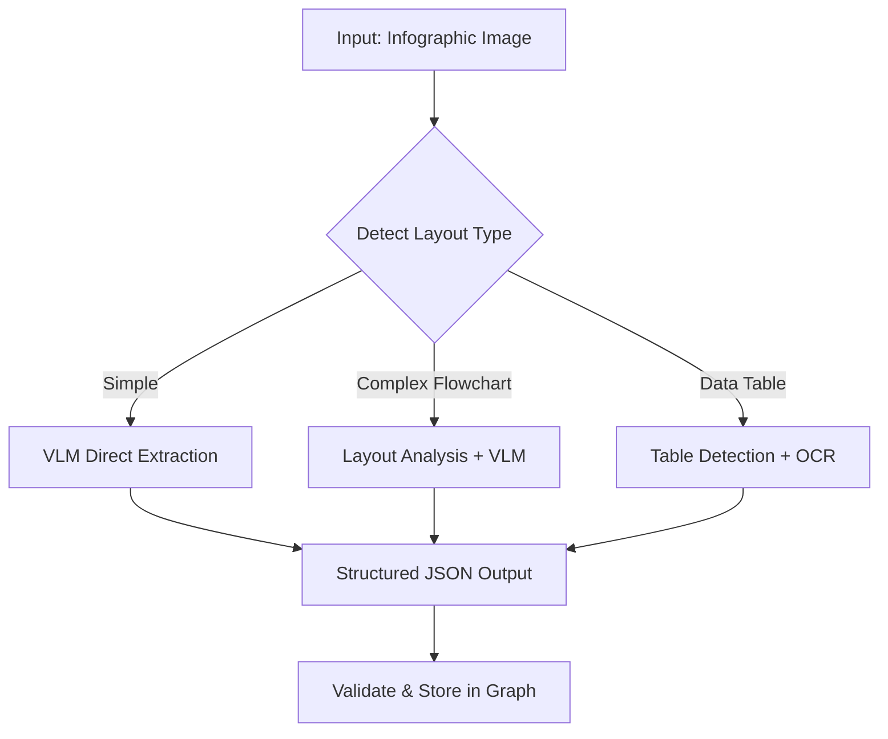
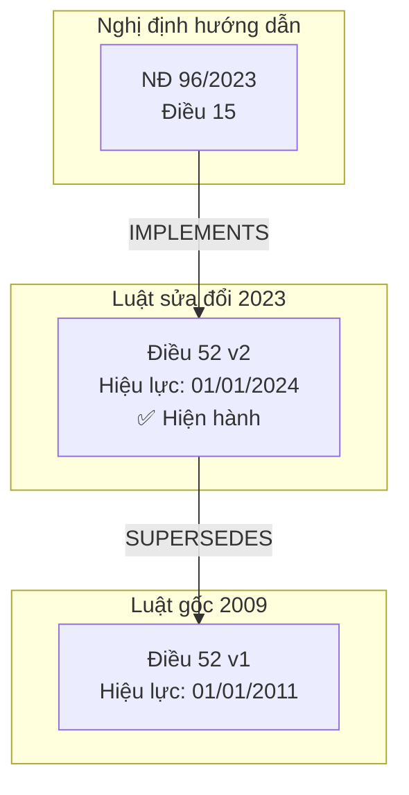
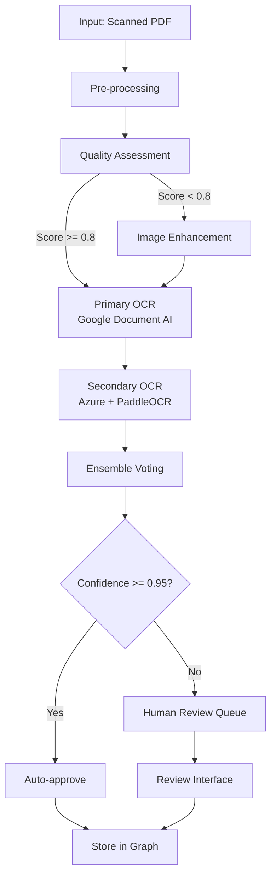
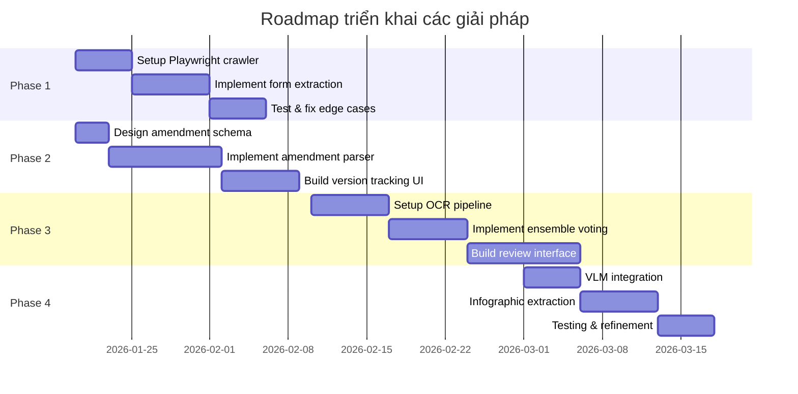

# Giải pháp cho các vấn đề Graph Luật Y tế

> **Ngày tạo**: 14/01/2026  
> **Mục tiêu**: Đề xuất giải pháp kỹ thuật cho 4 thách thức chính khi xây dựng Knowledge Graph Luật Y tế

---

## Tổng quan các vấn đề

| #   | Vấn đề                                          | Độ khó | Ưu tiên    |
| --- | ----------------------------------------------- | ------ | ---------- |
| 1   | Data dạng Infographic                           | ⭐⭐⭐    | Cao        |
| 2   | Viện dẫn nhiều hop (văn bản sửa đổi chồng chéo) | ⭐⭐⭐⭐   | Rất cao    |
| 3   | OCR file scan bệnh viện (yêu cầu >99% accuracy) | ⭐⭐⭐⭐⭐  | Rất cao    |
| 4   | Crawl link download mẫu đơn từ thuvienphapluat  | ⭐⭐⭐    | Trung bình |

---

## 1. Data dạng Infographic

### Mô tả vấn đề
- Infographic chứa thông tin pháp luật dưới dạng hình ảnh, biểu đồ, flowchart
- Text được nhúng trong hình ảnh, không thể extract trực tiếp
- Layout phức tạp, không theo cấu trúc văn bản thông thường

### Giải pháp đề xuất

#### Phương án 1: Sử dụng Vision Language Model (VLM) - **Khuyến nghị**

```python
# Sử dụng GPT-4V hoặc Gemini Pro Vision
from openai import OpenAI

def extract_infographic_content(image_path: str) -> dict:
    """
    Extract structured content from infographic using VLM
    """
    client = OpenAI()
    
    with open(image_path, "rb") as f:
        image_data = base64.b64encode(f.read()).decode()
    
    response = client.chat.completions.create(
        model="gpt-4-vision-preview",
        messages=[
            {
                "role": "system",
                "content": """Bạn là chuyên gia trích xuất thông tin pháp luật y tế từ infographic.
                Hãy trích xuất:
                1. Tiêu đề chính
                2. Các điểm chính (bullet points)
                3. Số liệu, thống kê
                4. Căn cứ pháp lý được đề cập
                5. Mối quan hệ giữa các thành phần (nếu có flowchart)
                
                Output dạng JSON có cấu trúc."""
            },
            {
                "role": "user",
                "content": [
                    {"type": "image_url", "image_url": {"url": f"data:image/png;base64,{image_data}"}}
                ]
            }
        ],
        max_tokens=4096
    )
    
    return json.loads(response.choices[0].message.content)
```

#### Phương án 2: Hybrid OCR + Layout Analysis

```python
# Kết hợp nhiều công cụ
from paddleocr import PaddleOCR
from layoutparser import Detectron2LayoutModel

def hybrid_infographic_extraction(image_path: str) -> dict:
    """
    1. Detect layout regions (title, chart, text blocks)
    2. Apply specialized extraction for each region type
    """
    # Bước 1: Layout detection
    model = Detectron2LayoutModel('lp://PubLayNet/mask_rcnn_X_101_32x8d_FPN_3x/config')
    layout = model.detect(image_path)
    
    # Bước 2: Extract text từ từng vùng
    ocr = PaddleOCR(lang='vi')
    results = {}
    
    for block in layout:
        region_image = crop_region(image_path, block.coordinates)
        text = ocr.ocr(region_image)
        results[block.type] = text
    
    return results
```

### Workflow xử lý Infographic



### Ước tính chi phí
- GPT-4V: ~$0.01-0.03 per infographic
- Gemini Pro Vision: ~$0.0025-0.005 per infographic (khuyến nghị cho volume lớn)

---

## 2. Viện dẫn nhiều Hop (Văn bản sửa đổi chồng chéo)

### Mô tả vấn đề
- Luật gốc (VD: Luật Khám bệnh, chữa bệnh 2009)
- Văn bản sửa đổi bổ sung (VD: Luật sửa đổi 2023)
- Nghị định hướng dẫn → Thông tư hướng dẫn nghị định → Công văn giải thích thông tư
- Cần trace được "phiên bản hiện hành" của một điều luật

### Giải pháp đề xuất

#### Schema mở rộng cho Neo4j

```cypher
// Node types
(:LegalDocument {
    id: string,
    title: string,
    doc_number: string,      // Số văn bản
    doc_type: string,        // Luật, Nghị định, Thông tư, Công văn
    effective_date: date,
    expiry_date: date,       // null nếu còn hiệu lực
    status: string           // "có hiệu lực", "hết hiệu lực", "được sửa đổi"
})

(:LegalArticle {
    id: string,
    article_number: string,  // Điều 52
    content: text,
    version: int,            // Version của điều luật này
    effective_date: date,
    current_version: boolean // true nếu là phiên bản hiện hành
})

// Relationship types
(:LegalDocument)-[:CONTAINS]->(:LegalArticle)
(:LegalDocument)-[:AMENDS {
    amendment_type: string,  // "sửa đổi", "bổ sung", "thay thế", "bãi bỏ"
    effective_date: date
}]->(:LegalDocument)

(:LegalArticle)-[:SUPERSEDES]->(:LegalArticle)  // Điều mới thay thế điều cũ
(:LegalArticle)-[:REFERENCES]->(:LegalArticle)  // Viện dẫn
(:LegalArticle)-[:IMPLEMENTS]->(:LegalArticle)  // Hướng dẫn thực hiện
```

#### Query để lấy phiên bản hiện hành

```cypher
// Lấy nội dung hiện hành của một điều luật
MATCH (doc:LegalDocument {doc_number: "40/2009/QH12"})-[:CONTAINS]->(article:LegalArticle)
WHERE article.article_number = "Điều 52"

// Tìm phiên bản mới nhất
OPTIONAL MATCH (article)-[:SUPERSEDES*]->(latest:LegalArticle)
WHERE latest.current_version = true

WITH article, latest
RETURN COALESCE(latest, article) as current_article,
       // Trace lịch sử sửa đổi
       [(article)-[:SUPERSEDES*]->(v) | v] as version_history
```

#### Pipeline xử lý văn bản sửa đổi

```python
class AmendmentProcessor:
    """
    Xử lý văn bản sửa đổi và cập nhật graph
    """
    
    AMENDMENT_PATTERNS = [
        r"sửa đổi[,]?\s*bổ sung\s+(Điều\s+\d+)",
        r"thay thế\s+(Điều\s+\d+)",
        r"bãi bỏ\s+(Điều\s+\d+)",
        r"bổ sung\s+(Điều\s+\d+\w?)\s+vào sau\s+(Điều\s+\d+)",
    ]
    
    def parse_amendments(self, amendment_doc: str) -> List[Amendment]:
        """
        Parse văn bản sửa đổi để xác định:
        - Điều nào bị sửa đổi
        - Loại sửa đổi (thay thế toàn bộ, sửa một phần, bãi bỏ)
        - Nội dung mới
        """
        amendments = []
        for pattern in self.AMENDMENT_PATTERNS:
            matches = re.findall(pattern, amendment_doc)
            for match in matches:
                amendments.append(self._extract_amendment_detail(match, amendment_doc))
        return amendments
    
    def update_graph(self, amendments: List[Amendment]):
        """
        Cập nhật Neo4j graph:
        1. Tạo node mới cho điều được sửa đổi
        2. Tạo relationship SUPERSEDES
        3. Đánh dấu current_version
        """
        with self.driver.session() as session:
            for amend in amendments:
                session.run("""
                    MATCH (old:LegalArticle {id: $old_id})
                    SET old.current_version = false
                    CREATE (new:LegalArticle {
                        id: $new_id,
                        article_number: old.article_number,
                        content: $new_content,
                        version: old.version + 1,
                        effective_date: $effective_date,
                        current_version: true
                    })
                    CREATE (new)-[:SUPERSEDES {
                        amendment_doc: $amendment_doc_id,
                        amendment_type: $type
                    }]->(old)
                """, parameters=amend.to_dict())
```

### Visualization cho Frontend



---

## 3. OCR File Scan Bệnh viện (Yêu cầu >99% Accuracy)

### Mô tả vấn đề
- File scan dài, chất lượng không đồng đều
- Yêu cầu độ chính xác >99% là rất cao
- Tiếng Việt với dấu phức tạp
- Có thể chứa bảng, biểu mẫu

### Phân tích thực tế về độ chính xác

> [!WARNING]
> **Độ chính xác 99%+ rất khó đạt được với OCR tự động**
> 
> - OCR tốt nhất hiện tại (Google Document AI, Azure Form Recognizer) đạt ~95-98% cho tiếng Việt chất lượng tốt
> - File scan chất lượng kém có thể chỉ đạt 85-95%
> - Để đạt 99%+, **bắt buộc phải có bước human review**

### Giải pháp đề xuất: Pipeline OCR đa tầng



#### Bước 1: Pre-processing

```python
import cv2
import numpy as np
from pdf2image import convert_from_path

class DocumentPreprocessor:
    def process(self, pdf_path: str) -> List[np.ndarray]:
        """
        Pre-process scanned document for optimal OCR
        """
        images = convert_from_path(pdf_path, dpi=300)
        processed = []
        
        for img in images:
            img_array = np.array(img)
            
            # 1. Deskew (chỉnh nghiêng)
            img_array = self._deskew(img_array)
            
            # 2. Noise removal
            img_array = cv2.fastNlMeansDenoisingColored(img_array, None, 10, 10, 7, 21)
            
            # 3. Binarization (adaptive threshold)
            gray = cv2.cvtColor(img_array, cv2.COLOR_BGR2GRAY)
            binary = cv2.adaptiveThreshold(
                gray, 255, cv2.ADAPTIVE_THRESH_GAUSSIAN_C, 
                cv2.THRESH_BINARY, 11, 2
            )
            
            # 4. Border removal
            binary = self._remove_borders(binary)
            
            processed.append(binary)
        
        return processed
    
    def _deskew(self, image: np.ndarray) -> np.ndarray:
        """Correct document skew angle"""
        gray = cv2.cvtColor(image, cv2.COLOR_BGR2GRAY)
        edges = cv2.Canny(gray, 50, 150, apertureSize=3)
        lines = cv2.HoughLines(edges, 1, np.pi/180, 200)
        
        if lines is not None:
            angles = [line[0][1] for line in lines]
            median_angle = np.median(angles)
            angle = (median_angle - np.pi/2) * 180 / np.pi
            
            if abs(angle) < 10:  # Only correct small angles
                center = tuple(np.array(image.shape[1::-1]) / 2)
                rot_mat = cv2.getRotationMatrix2D(center, angle, 1.0)
                image = cv2.warpAffine(image, rot_mat, image.shape[1::-1])
        
        return image
```

#### Bước 2: Ensemble OCR

```python
from google.cloud import documentai_v1 as documentai
from azure.ai.formrecognizer import DocumentAnalysisClient
from paddleocr import PaddleOCR

class EnsembleOCR:
    def __init__(self):
        self.google_client = self._init_google_documentai()
        self.azure_client = self._init_azure_formrecognizer()
        self.paddle_ocr = PaddleOCR(lang='vi', use_angle_cls=True)
    
    def process(self, image: np.ndarray) -> OCRResult:
        """
        Run multiple OCR engines and ensemble results
        """
        # Run all OCR engines in parallel
        results = {
            'google': self._run_google_ocr(image),
            'azure': self._run_azure_ocr(image),
            'paddle': self._run_paddle_ocr(image)
        }
        
        # Ensemble voting at word level
        final_text, confidence_map = self._ensemble_vote(results)
        
        return OCRResult(
            text=final_text,
            confidence=np.mean(list(confidence_map.values())),
            word_confidences=confidence_map,
            low_confidence_words=self._get_low_confidence_words(confidence_map)
        )
    
    def _ensemble_vote(self, results: dict) -> Tuple[str, dict]:
        """
        Voting strategy:
        - If 2/3 engines agree: use that result
        - If all different: use result with highest confidence
        - Flag words with disagreement for review
        """
        # Align texts from different engines
        aligned = self._align_ocr_outputs(results)
        
        final_words = []
        confidence_map = {}
        
        for i, word_variants in enumerate(aligned):
            if len(set(word_variants.values())) == 1:
                # All agree
                word = list(word_variants.values())[0]
                confidence_map[i] = 0.99
            else:
                # Voting
                word, conf = self._vote_word(word_variants)
                confidence_map[i] = conf
            
            final_words.append(word)
        
        return ' '.join(final_words), confidence_map
```

#### Bước 3: Human Review Interface

```python
class HumanReviewQueue:
    """
    Quản lý queue các document cần human review
    """
    
    def add_to_queue(self, doc_id: str, ocr_result: OCRResult):
        """
        Add document to review queue with highlighted low-confidence areas
        """
        review_item = {
            'doc_id': doc_id,
            'text': ocr_result.text,
            'low_confidence_words': ocr_result.low_confidence_words,
            'original_image': self._get_image_with_highlights(
                doc_id, 
                ocr_result.low_confidence_words
            ),
            'status': 'pending',
            'created_at': datetime.now()
        }
        
        self.redis_client.lpush('ocr_review_queue', json.dumps(review_item))
    
    def get_review_stats(self) -> dict:
        """
        Thống kê review queue
        """
        return {
            'pending': self.redis_client.llen('ocr_review_queue'),
            'reviewed_today': self._count_reviewed_today(),
            'avg_review_time': self._calc_avg_review_time(),
            'accuracy_after_review': self._calc_post_review_accuracy()
        }
```

### Ước tính chi phí và thời gian

| Thành phần              | Chi phí          | Thời gian/page |
| ----------------------- | ---------------- | -------------- |
| Google Document AI      | $0.05/page       | ~2-5s          |
| Azure Form Recognizer   | $0.05/page       | ~3-6s          |
| PaddleOCR (self-hosted) | Miễn phí         | ~5-10s         |
| Human Review            | ~10,000 VND/page | ~2-5 phút      |

> [!IMPORTANT]
> **Khuyến nghị**: Với yêu cầu 99%+ accuracy, ngân sách human review khoảng **5-10% tổng số trang** cho các trường hợp confidence thấp.

---

## 4. Crawl Link Download Mẫu Đơn từ Thuvienphapluat

### Mô tả vấn đề
- Nội dung văn bản có chứa link "Tải mẫu đơn"
- Click vào hiện popup
- Trong popup có nút "Tải xuống" với link download thực
- Cần thao tác thủ công để lấy link

### Giải pháp đề xuất: Playwright-based Crawler

```python
import asyncio
from playwright.async_api import async_playwright, Page, Browser
import re

class ThuvienPhapLuatFormCrawler:
    """
    Crawler chuyên biệt để lấy link download mẫu đơn từ thuvienphapluat.vn
    """
    
    FORM_LINK_PATTERNS = [
        r"Mẫu\s+\d+",
        r"Phụ\s+lục\s+\w+",
        r"Tải\s+mẫu",
        r"Download\s+mẫu",
    ]
    
    async def crawl_document(self, url: str) -> DocumentWithForms:
        """
        Crawl document và extract tất cả form download links
        """
        async with async_playwright() as p:
            browser = await p.chromium.launch(headless=True)
            context = await browser.new_context(
                user_agent='Mozilla/5.0 (Windows NT 10.0; Win64; x64) ...',
                viewport={'width': 1920, 'height': 1080}
            )
            page = await context.new_page()
            
            # Navigate to document
            await page.goto(url, wait_until='networkidle')
            
            # Extract main content
            content = await self._extract_content(page)
            
            # Find and process form links
            forms = await self._extract_form_downloads(page)
            
            await browser.close()
            
            return DocumentWithForms(
                url=url,
                content=content,
                forms=forms
            )
    
    async def _extract_form_downloads(self, page: Page) -> List[FormDownload]:
        """
        Tìm và lấy tất cả link download mẫu đơn
        """
        forms = []
        
        # Find all potential form links
        form_links = await page.query_selector_all(
            'a[href*="mau"], a[href*="form"], a[href*="phu-luc"], '
            'a:has-text("Tải mẫu"), a:has-text("Download"), '
            '.download-link, .form-download'
        )
        
        for link in form_links:
            try:
                form = await self._process_form_link(page, link)
                if form:
                    forms.append(form)
            except Exception as e:
                logging.warning(f"Failed to process form link: {e}")
        
        return forms
    
    async def _process_form_link(self, page: Page, link) -> Optional[FormDownload]:
        """
        Click vào link, xử lý popup, lấy download URL
        """
        link_text = await link.inner_text()
        
        # Setup listener for popup/dialog
        popup_promise = page.wait_for_event('popup', timeout=5000)
        dialog_appeared = False
        
        # Also watch for modal dialog
        async def handle_modal():
            modal = await page.wait_for_selector(
                '.modal, .popup, .dialog, [role="dialog"]',
                timeout=5000,
                state='visible'
            )
            return modal
        
        # Click the link
        await link.click()
        
        # Wait for either popup window or modal
        try:
            popup = await popup_promise
            download_url = await self._extract_from_popup(popup)
            await popup.close()
        except:
            # Try modal instead
            modal = await handle_modal()
            download_url = await self._extract_from_modal(page, modal)
            await self._close_modal(page, modal)
        
        if download_url:
            # Download the file
            file_path = await self._download_file(download_url, link_text)
            
            return FormDownload(
                name=link_text,
                download_url=download_url,
                local_path=file_path,
                file_type=self._detect_file_type(file_path)
            )
        
        return None
    
    async def _extract_from_modal(self, page: Page, modal) -> Optional[str]:
        """
        Extract download URL from modal dialog
        """
        # Look for download button in modal
        download_btn = await modal.query_selector(
            'a[download], a:has-text("Tải xuống"), a:has-text("Download"), '
            'button:has-text("Tải"), .btn-download'
        )
        
        if download_btn:
            href = await download_btn.get_attribute('href')
            if href:
                return href
            
            # If button triggers download, intercept the request
            async with page.expect_download() as download_info:
                await download_btn.click()
            download = await download_info.value
            return download.url
        
        return None
    
    async def _close_modal(self, page: Page, modal):
        """
        Close modal dialog
        """
        close_btn = await modal.query_selector(
            '.close, .btn-close, [aria-label="Close"], '
            'button:has-text("Đóng"), button:has-text("×")'
        )
        
        if close_btn:
            await close_btn.click()
        else:
            # Press Escape
            await page.keyboard.press('Escape')
        
        # Wait for modal to disappear
        await page.wait_for_selector(
            '.modal, .popup, .dialog',
            state='hidden',
            timeout=3000
        )
    
    async def _download_file(self, url: str, name: str) -> str:
        """
        Download file and save locally
        """
        async with aiohttp.ClientSession() as session:
            async with session.get(url) as response:
                content = await response.read()
                
                # Determine file extension
                content_type = response.headers.get('content-type', '')
                ext = self._get_extension(content_type, url)
                
                # Save file
                filename = f"{slugify(name)}{ext}"
                filepath = os.path.join(self.download_dir, filename)
                
                with open(filepath, 'wb') as f:
                    f.write(content)
                
                return filepath
```

### Tích hợp vào Pipeline hiện tại

```python
# Trong crawler chính, thêm xử lý form download
class EnhancedThuvienPhapLuatCrawler(BaseThuvienPhapLuatCrawler):
    
    def __init__(self):
        super().__init__()
        self.form_crawler = ThuvienPhapLuatFormCrawler()
    
    async def crawl(self, url: str) -> CrawlResult:
        # Crawl nội dung chính (existing logic)
        result = await super().crawl(url)
        
        # Thêm xử lý form downloads
        if self._has_form_links(result.content):
            forms = await self.form_crawler.crawl_document(url)
            result.forms = forms.forms
            
            # Store forms in graph
            for form in forms.forms:
                await self._store_form_in_graph(result.doc_id, form)
        
        return result
    
    async def _store_form_in_graph(self, doc_id: str, form: FormDownload):
        """
        Lưu thông tin mẫu đơn vào graph
        """
        await self.neo4j_client.run("""
            MATCH (doc:LegalDocument {id: $doc_id})
            CREATE (form:FormTemplate {
                id: $form_id,
                name: $name,
                file_path: $file_path,
                file_type: $file_type,
                download_url: $download_url
            })
            CREATE (doc)-[:HAS_FORM]->(form)
        """, parameters={
            'doc_id': doc_id,
            'form_id': f"form_{doc_id}_{slugify(form.name)}",
            'name': form.name,
            'file_path': form.local_path,
            'file_type': form.file_type,
            'download_url': form.download_url
        })
```

---

## Roadmap triển khai



## Tổng kết

| Vấn đề                | Giải pháp chính                 | Độ phức tạp | Thời gian ước tính |
| --------------------- | ------------------------------- | ----------- | ------------------ |
| Infographic           | VLM (GPT-4V/Gemini)             | Trung bình  | 2 tuần             |
| Multi-hop citations   | Neo4j schema + Amendment parser | Cao         | 3 tuần             |
| OCR 99%+              | Ensemble OCR + Human review     | Rất cao     | 4 tuần             |
| Form download crawler | Playwright automation           | Trung bình  | 2 tuần             |

> [!TIP]
> **Khuyến nghị ưu tiên**: 
> 1. Form download crawler (có thể triển khai nhanh, giá trị cao)
> 2. Multi-hop citations (core feature cho legal domain)
> 3. OCR pipeline (đầu tư lớn nhất, cần planning kỹ)
> 4. Infographic (có thể dùng workaround manual trong giai đoạn đầu)
